# README

## 项目简介

<div style="display: flex; justify-content: space-between;">
  <div style="flex: 1; text-align: center;">
    <h4 class="artistic-font">人像抠图</h4>
  </div>
  <div style="flex: 1; text-align: center;">
    <h4 class="artistic-font">证件照制作</h4>
  </div>
  <div style="flex: 1; text-align: center;">
    <h4 class="artistic-font">更换背景</h4>
  </div>
</div>  
<div style="display: flex;">
    
    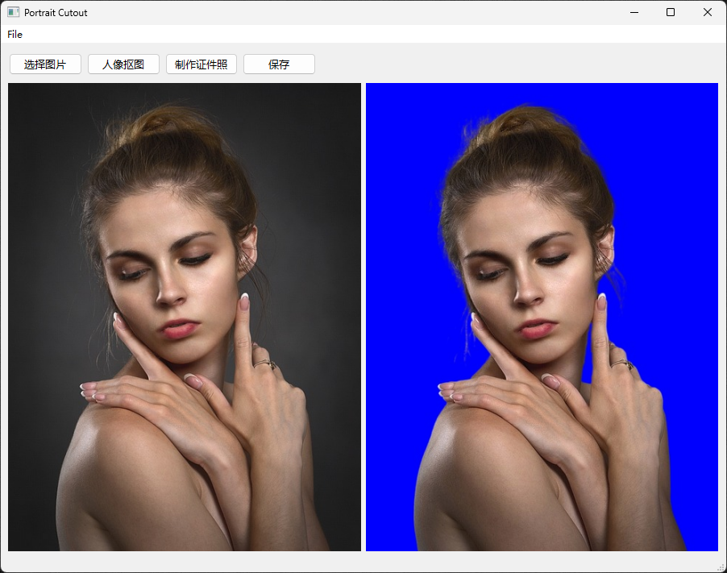
    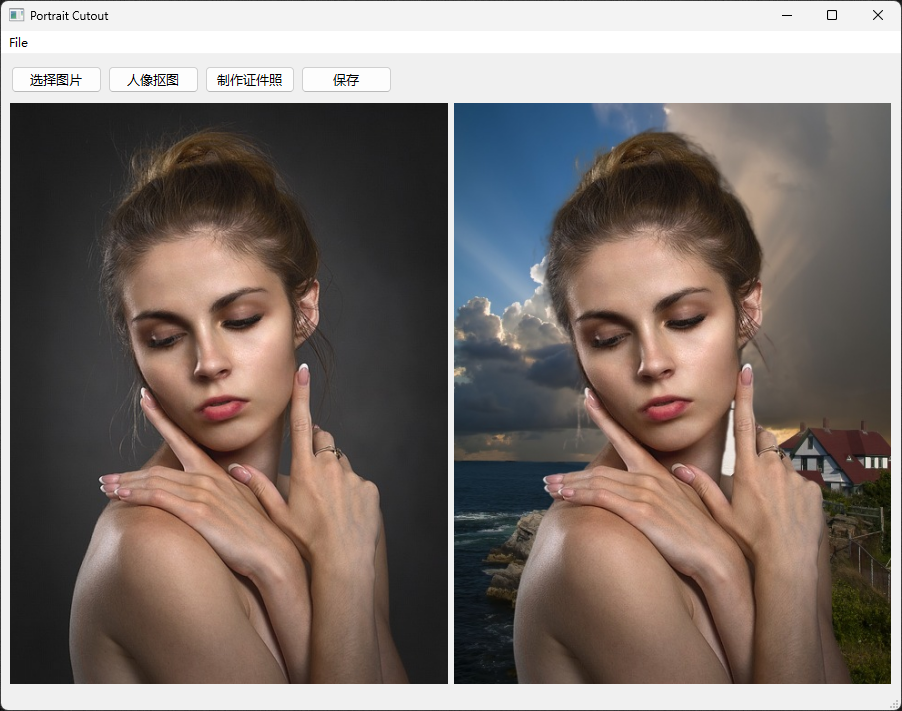
</div>
## 项目依赖


|   平台    |  软件  |                           开发套件                           |    模型     |                          环境                          |
| :-------: | :----: | :----------------------------------------------------------: | :---------: | :----------------------------------------------------: |
| Windows11 | VSCode | **[PaddleSeg-Matting](https://github.com/PaddlePaddle/PaddleSeg)** ,PyQt5 | ppmattingv2 | `Python 3.9.18`，`PaddlePaddle-gpu 2.5.2`，`cuda 10.2` |

> 本地所用conda环境：PortraitCutout

## 项目结构

```sh
PortraitCutout/
|--demo/ 
|  |--image/  # Image for testing
|  |--output/ # Some output results
|
|--PaddleSeg/ # PaddleSeg development kit
|
|--res/ # README source files
|
|--Scripts/ # Project source code
|
|--README.md
```

## 环境配置

##### 1. conda 创建 env 环境

其中的`PortraitCutout`可自定义为其他名称

```sh
conda create --name PortraitCutout python=3.9.18
```

成功创建环境后使用以下命令激活所创建的环境

```sh
conda activate PortraitCutout
```

> 默认用户已成功安装[Anaconda](https://www.anaconda.com/download/)。

##### 2. 安装PaddlePaddle

笔者环境的conda版本为10.2，使用如下命令安装，若conda环境不同，请前往[Paddle](https://www.paddlepaddle.org.cn/install/old)官网查看安装命令。

```sh
conda install paddlepaddle-gpu==2.5.2 cudatoolkit=10.2 --channel https://mirrors.tuna.tsinghua.edu.cn/anaconda/cloud/Paddle/
```

安装完成后可以在终端输入如下命令进行查看，若最终出现`PaddlePaddle is installed successfully!`则为安装成功。

```sh
python
>> import paddle
>> paddle.utils.run_check()
```

##### 3. 安装PyQt5

```sh
pip install PyQt5
pip install pyqt5-tools
```

##### 4. 安装PaddleSeg

```sh
cd PaddleSeg
pip install -r requirements.txt
pip install -v -e .
```

##### 5. 配置Paddle-Matting

```sh
cd PaddleSeg/Matting
pip install "paddleseg>=2.5"
pip install -r requirements.txt
```

## 使用

#### 1. 打开程序

```sh
cd ./Scripts/
python ./main.py
```

在当前项目根目录下，在终端运行上述程序即可打开程序交互窗口

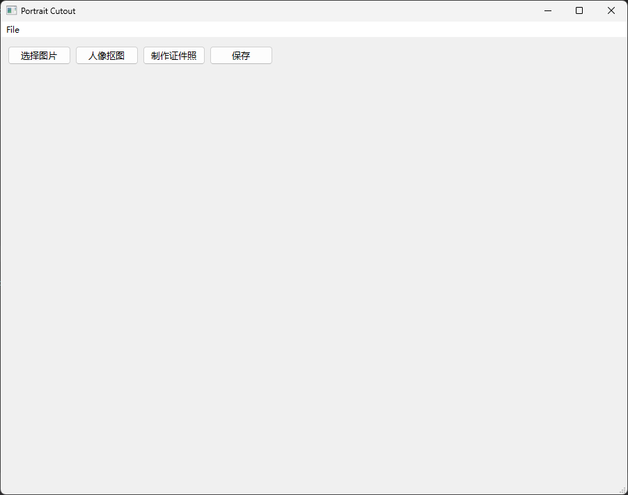

#### 2. 导入图片

##### 2.1 使用菜单栏导入图片

在最上方菜单栏选择 `File` -> `Open` 即可弹出选择图片对话窗口，在本地文件夹选择需要导入的图片，确定后可在界面上看到所选择的图片。

##### 2.2 使用交互按钮导入图片

单击 `选择图片` 交互按钮，即可弹出选择图片对话窗口，在本地文件夹选择需要导入的图片，确定后可在界面上看到所选择的图片。

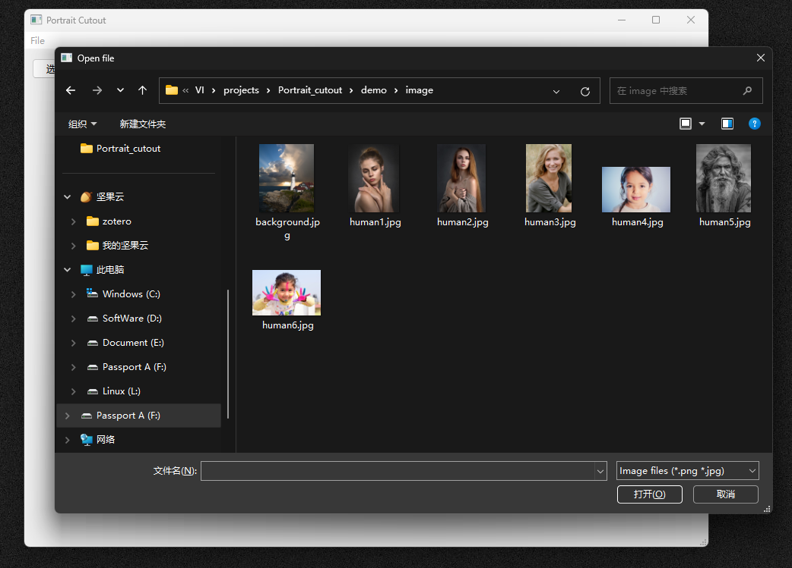

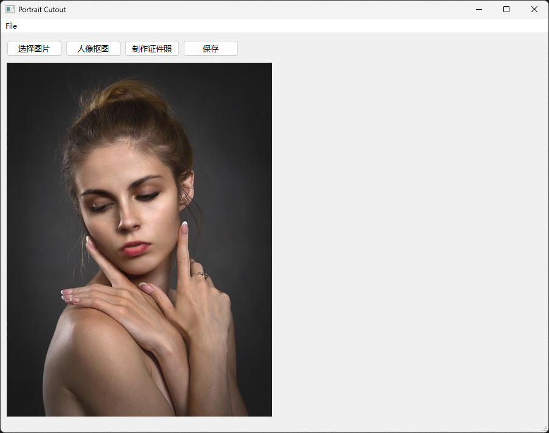

#### 3. 人像抠图

导入图片后单击 `人像抠图` 交互按钮，等待一两秒即可在界面上看到抠图后的图片效果。

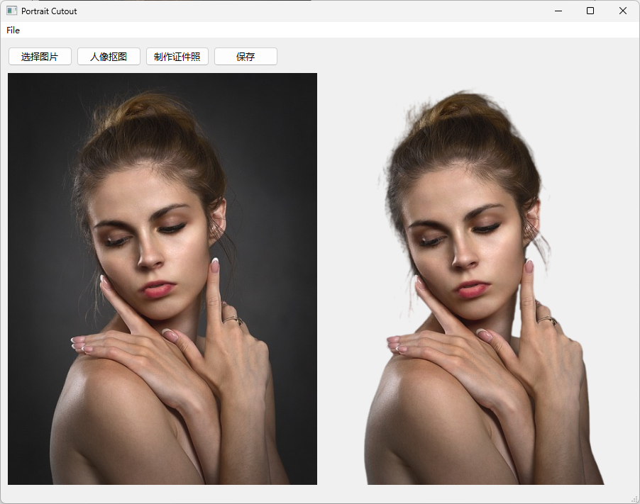

#### 4. 制作证件照

单击 `制作证件照` 交互按钮，在弹出的设置窗口中选择需要的**底色**和**尺寸**，选择完成后单击确定等待一两秒后即可在界面看到最终效果。

> **NOTE:** 
>
> **底色：**仅支持白、红、蓝、绿、图片。
>
> **尺寸：**支持1寸、2寸、3寸、5寸、6寸、7寸、8寸、10寸、12寸、原图尺寸、护照尺寸(小2寸)、身份证尺寸、自定义尺寸。

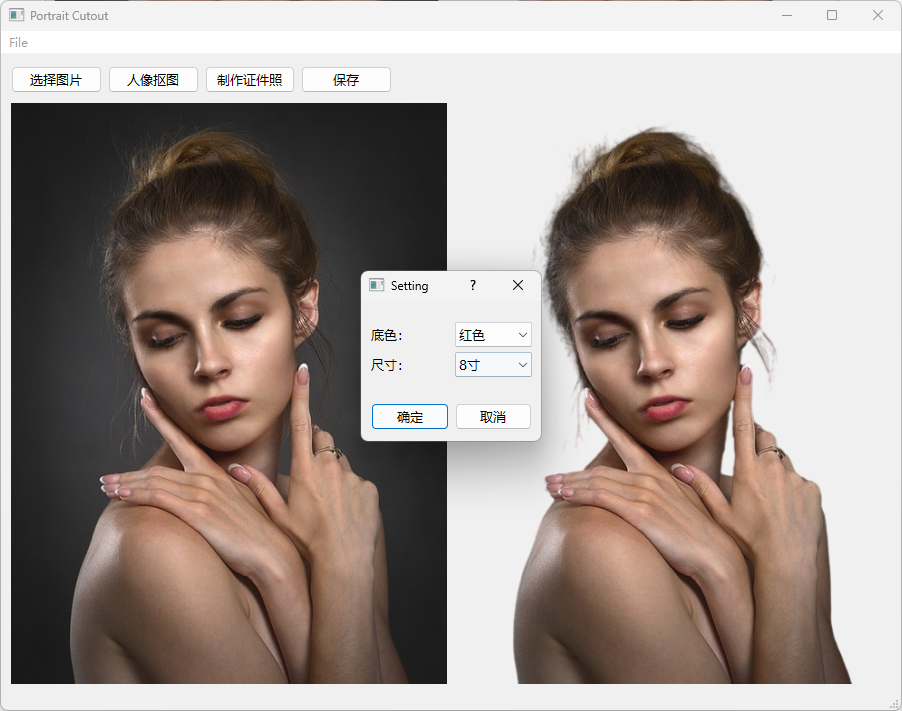

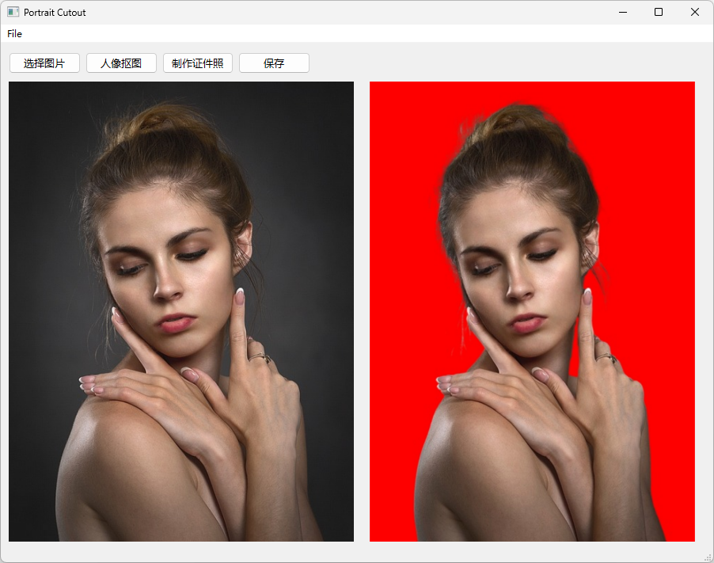

#### 5. 更换人像背景

单击 `制作证件照` 在弹出的设置窗口中 `底色` 选择 `图片` ，单击确定后在弹出的图片选择窗口中选择需要更换的背景图片，确定后等待一两秒即可在界面上看到更换后的图片效果。

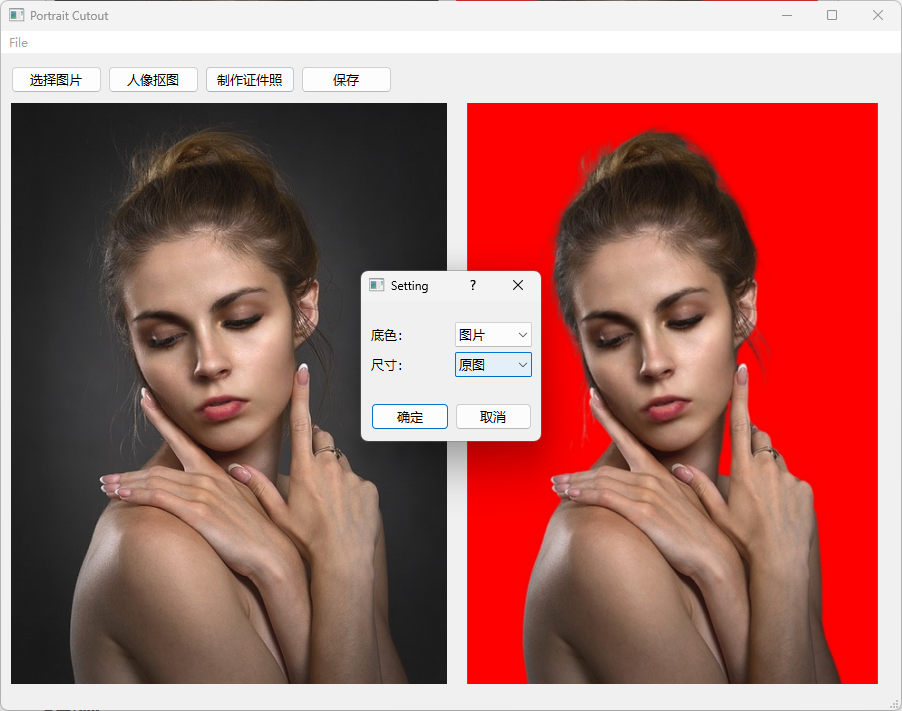

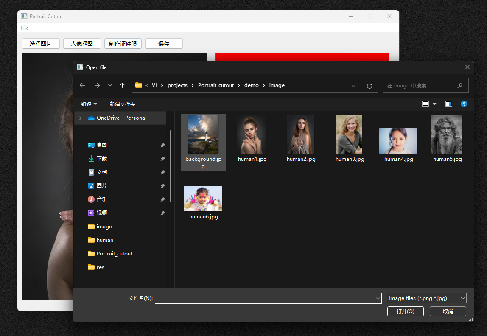

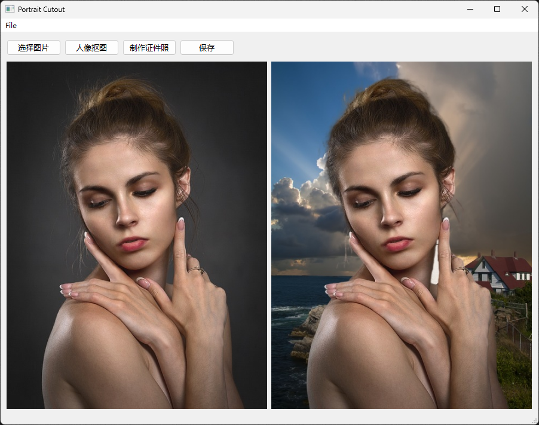

#### 6. 保存图片

单击 `保存` 交互按钮，在弹出的对话框中选择所要存储的路径并填写图片保存时的名称，确定后即可将当前界面右侧所显示的图片进行保存。

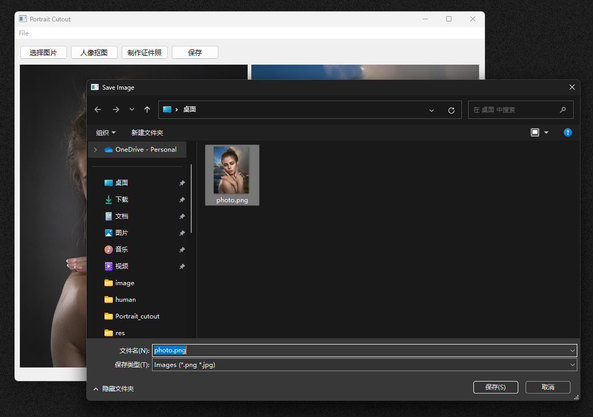

#### 7. 清除工作区图像

在最上方菜单栏选择 `File` -> `Close` 即可清除当前工作区的所有图像。

## 相关命令

### 预测

```sh
python tools/predict.py --config configs/ppmattingv2/ppmattingv2-stdc1-human_512.yml --model_path pretrained_models/ppmattingv2-stdc1-human_512.pdparams --image_path F:/VI/projects/Portrait_cutout/demo/image/humen1.jpg --save_dir F:/VI/projects/Portrait_cutout/demo/output/ --fg_estimate True
```

### 背景替换

```sh
python tools/bg_replace.py --config configs/ppmattingv2/ppmattingv2-stdc1-human_512.yml --model_path pretrained_models/ppmattingv2-stdc1-human_512.pdparams --image_path F:/VI/projects/Portrait_cutout/demo/image/humen1.jpg --background 'g' --save_dir F:/VI/projects/Portrait_cutout/demo/output/ --fg_estimate True
```

## 参考资料

[PaddleSeg/Matting at release/2.9 · PaddlePaddle/PaddleSeg (github.com)](https://github.com/PaddlePaddle/PaddleSeg/tree/release/2.9/Matting)

[Qt designer界面和所有组件功能的详细介绍（全！！！）-CSDN博客](https://blog.csdn.net/qq_43811536/article/details/135186862#:~:text=Widget Box（部件盒） ：Widget Box位于Qt Designer界面的左侧，它提供了各种可用的窗口部件（widgets）。,可以从Widget Box中拖放这些部件到主界面编辑区域，以构建GUI界面。 Widget Box中的部件包括 按钮、标签、文本框、下拉列表 等。)

[PyQt5(一) PyQt5安装及配置，从文件夹读取图片并显示，模拟生成素描图像_pyqt5读取图片-CSDN博客](https://blog.csdn.net/m0_47682721/article/details/123928585)